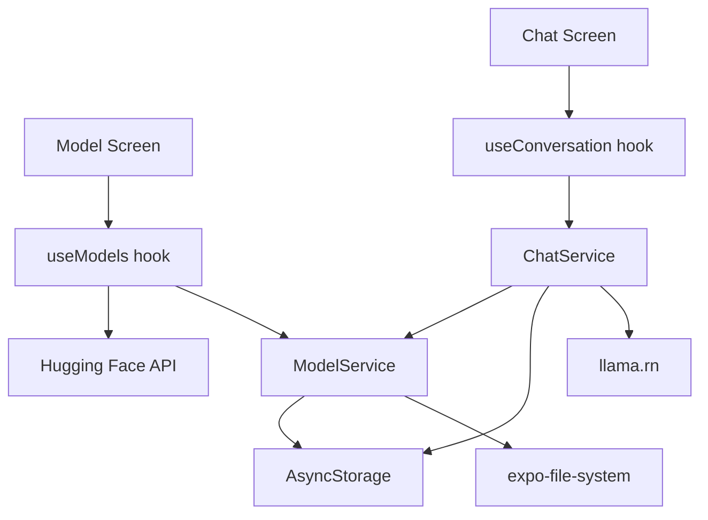

# Offgrid AI - Project Meeting Brief

## 1. Executive Summary

**Offgrid AI** is a React Native + Expo mobile app that lets a user:

- browse a curated list of GGUF language models,
- download a model from Hugging Face to the device,
- store that model locally,
- and chat with the model directly on the phone using `llama.rn`.

The main idea is **local-first LLM usage on mobile**. After a model is downloaded, inference happens on-device instead of through a backend API.

## 2. One-Line Pitch

> Offgrid AI is a mobile proof of concept for private, on-device AI chat: users download compact LLMs once, then run conversations locally on their own device.

## 3. What Problem This Project Solves

Most AI chat apps depend on cloud APIs, which creates:

- privacy concerns,
- ongoing inference costs,
- internet dependency,
- and backend complexity.

This project explores a different model:

- use Hugging Face only as the model source,
- keep downloaded models on the device,
- and run inference locally with no server in the middle.

## 4. Current Product Scope

This app is best described as an **MVP / prototype** rather than a production-ready product.

Today it supports:

- model discovery from a small curated list,
- model download with progress,
- persistence of downloaded models,
- a chat interface with streaming responses,
- conversation history stored locally,
- deleting models,
- deleting messages,
- and stopping generation mid-response.

## 5. User Flow

### A. Model discovery

The user opens the app and lands on the model library screen.

- `Downloaded` tab shows models already stored on-device.
- `All Models` shows models fetched from Hugging Face metadata.
- Search filters by name, description, and tags.

### B. Model download

When the user taps download:

- the app fetches the `.gguf` file directly from Hugging Face,
- stores it in the app document directory,
- tracks progress in the UI,
- and saves model metadata in `AsyncStorage`.

### C. Local chat

When the user opens a downloaded model:

- the app loads the GGUF file through `llama.rn`,
- creates or reuses the latest conversation for that model,
- sends the message to the local model,
- streams tokens back into the UI,
- and persists the final conversation locally.

### D. Offline behavior

Important nuance for the meeting:

- **Internet is required for browsing and downloading models**
- **Internet is not required for chatting after a model is already downloaded**

So this is not fully offline from the very first launch, but it is **offline-capable after model setup**.

## 6. Architecture Overview

## 7. Main Technical Building Blocks

### Frontend

- Expo 53
- React Native 0.79
- Expo Router for file-based navigation
- mostly `StyleSheet`-based UI, with some NativeWind scaffolding present

### Local AI / native layer

- `llama.rn` for on-device inference
- native Android and iOS folders are included because this is not a pure Expo Go-only app

### Persistence

- `expo-file-system` for GGUF model files
- `AsyncStorage` for downloaded model metadata and chat history

### Connectivity / data fetching

- `axios` for Hugging Face model metadata
- `@react-native-community/netinfo` for internet state

## 8. Actual App Structure

### Main screens

- `src/app/index.tsx`
  Model listing, tabs, search, download/delete actions
- `src/app/[modelId].tsx`
  Chat UI for a selected local model

### Core hooks

- `src/hooks/useModels.ts`
  Handles connectivity, fetching model metadata, loading downloaded models, downloads, and deletion
- `src/hooks/useConversation.ts`
  Handles chat state, streaming text, deleting messages, refreshing, clearing, and stopping generation

### Core services

- `src/lib/model.service.ts`
  Downloads models, stores files, saves model metadata
- `src/lib/chat.service.ts`
  Loads local models into `llama.rn`, manages conversations, persists messages

## 9. How Local LLM Inference Works Here

The chat engine is intentionally simple:

1. A GGUF model is downloaded from Hugging Face.
2. The local file path is saved.
3. `ChatService` loads that file with `initLlama(...)`.
4. The app keeps one active model context at a time.
5. Messages are passed to `completion(...)`.
6. Tokens stream back to the UI.
7. Final messages are stored in `AsyncStorage`.

Current runtime configuration in code:

- context size: `2048`
- GPU layers: `1`
- `use_mlock: true`
- max predicted tokens: `10000`

This shows the project is already doing real local inference, not just mocking a local AI experience.

## 10. Current Model Strategy

The app does not yet support open search across all of Hugging Face.

Instead, it uses a **hardcoded curated model list** inside `src/hooks/useModels.ts`, currently pointing to compact GGUF models such as:

- Llama 3.2 1B Instruct
- DeepSeek R1 Distill Qwen 1.5B
- Qwen 2.5 0.5B Instruct
- SmolLM2 1.7B Instruct

This is a good MVP decision because it keeps the product focused and avoids exposing users to incompatible or oversized models.

## 11. Data Storage Design

### Model files

- Stored in the app document directory under `models/`
- Managed by `expo-file-system`

### Model metadata

- Stored in `AsyncStorage`
- storage key: `@local_ai_chat/models`

### Conversations

- Stored in `AsyncStorage`
- storage key: `@local_ai_chat/conversations`

### Backend

- There is **no custom backend**
- Hugging Face is used as the model source only
- Inference and conversation storage are local to the device

## 12. Strengths of the Project

### Product strengths

- Strong privacy story because inference runs on-device
- Reduced backend cost because there is no cloud inference pipeline
- Offline-capable chat after model download
- Clear, understandable user journey
- Good proof of concept for “AI without a server”

### Engineering strengths

- Clean separation between UI, hooks, and service layer
- File-based routing is simple and readable
- Local persistence is already implemented
- Streaming responses make the app feel alive
- Native integration with `v` is already working in the codebase

## 13. Current Limitations and Risks

These are the most important points to mention honestly if someone asks about maturity.

### Product limitations

- Only a small fixed set of models is available
- No settings screen for inference tuning
- No multi-conversation management UI
- No import flow for custom local GGUF models
- No onboarding around model size, RAM usage, or device compatibility

### Technical limitations

- README and older docs say Jotai is used, but current code does not actually use Jotai
- `react-query`, bottom sheet, select, and some UI scaffolding are present but mostly unused
- Custom Urbanist fonts are referenced but not actually loaded from assets
- There are no meaningful automated tests yet
- Lint passes with warnings, mostly around hook dependencies and unused code

### Functional / quality risks found during analysis

- The chat header passes a custom right-side action view, but the `Header` component only renders right actions when `onRightPress` is provided, so refresh/trash controls may not appear as intended
- The project positions itself as offline AI, but model discovery and first-time setup still depend on internet access
- Some documentation claims more architecture than the code currently implements
- The app uses a singleton service pattern and local state, which is fine for MVP speed, but it will become harder to scale once settings, analytics, syncing, and multi-session flows are added

## 14. Honest Project Assessment

If I had to summarize the project status in one sentence:

> This is a solid local-AI mobile prototype with a real working inference pipeline, but it still needs product hardening, cleanup, and a few correctness fixes before it can be called production-ready.

## 15. Suggested Talking Track for the Meeting

### 30-second version

“Offgrid AI is a mobile prototype for running compact language models directly on the device. Users can download GGUF models from Hugging Face, store them locally, and chat without relying on a backend inference API after setup. The app proves the local-first architecture works, and the next step is turning it from a prototype into a polished product.”

### 2-minute version

“The goal of this project was to explore local LLM usage on mobile. Instead of sending prompts to a server, the app downloads compact GGUF models from Hugging Face and runs them locally using `llama.rn`. The app has two main experiences: model management and chat. On the model screen, users can browse a curated set of compatible models, download them, and manage local storage. On the chat screen, they can talk to the selected model with streaming responses, and conversations are saved locally with AsyncStorage. From an architecture perspective, it is a clean mobile-first implementation with Expo Router on the frontend, `expo-file-system` for model storage, and a local inference service around `llama.rn`. The biggest strengths are privacy, no backend dependency for inference, and a simple user flow. The biggest gaps are product polish, configuration, test coverage, and a few implementation mismatches that should be cleaned up before a broader release.”

## 16. Likely Questions and Good Answers

### “Is it fully offline?”

Not from the very first launch. Browsing and downloading models requires internet, but once a model is downloaded, chatting can happen locally on-device.

### “Why is this useful instead of calling OpenAI or another cloud API?”

The main value is privacy, reduced recurring cost, lower backend complexity, and the ability to support local/offline use cases.

### “Why only a few models?”

Because mobile local inference needs carefully chosen compact models. A curated list is safer for MVP quality and compatibility than exposing the full Hugging Face catalog.

### “Is this production-ready?”

Not yet. The core concept works, but it still needs cleanup, testing, better UX, and some technical hardening.

## 17. Recommended Action Plan

### Priority 1 - fix correctness and alignment

- fix the chat header action rendering issue
- remove or wire up unused scaffolding
- align README and docs with the real architecture
- clean lint warnings and hook dependency issues
- fix the font setup or remove the unused custom font references

### Priority 2 - improve product readiness

- add a proper model details / compatibility screen
- add settings for context length, response length, and generation behavior
- improve offline messaging so users clearly understand what works offline and what does not
- add conversation list / new chat flow instead of only reusing the latest conversation

### Priority 3 - expand the local AI experience

- support importing custom GGUF files
- support a broader curated model catalog
- show RAM/storage guidance before download
- add performance benchmarking per device/model

### Priority 4 - production hardening

- add unit tests for services and hooks
- add integration tests for download and chat flows
- add crash monitoring / error reporting
- validate device limitations and failure states more carefully

## 18. Final Project Positioning

The best way to present this project is:

> Offgrid AI is a working demonstration of local LLM inference on mobile, built as a focused MVP. It successfully proves the architecture for downloading, storing, and chatting with on-device models, and it creates a strong foundation for a privacy-first mobile AI product.

## 19. If You Want a Very Short Closing Line

“Technically, the hardest part is already proven: local model download, storage, loading, and on-device chat are all in place. What remains is turning the prototype into a polished product.”
